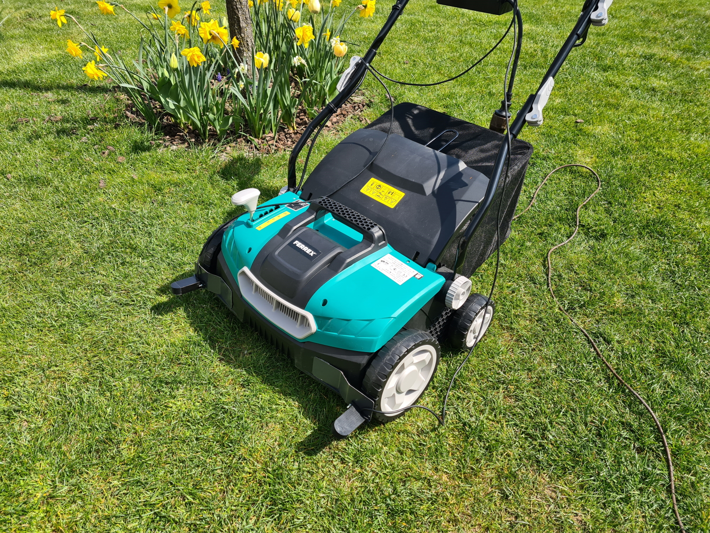

Maker Media GmbH

***

# Der Rasenkabelfinder

**Die meisten Mähroboter benötigen ein Kabel im Rasen als Spielfeldbegrenzung. Bei meinem Versuch, den so präparierten Rasen zu lüften und zu vertikutieren, habe ich dieses Begrenzungskabel zerstört. Eine technische Lösung musste her, um das in Zukunft zu verhindern – und hier ist sie.**

Hier gibt es den Arduino-Code sowie die Vorlagendateien für die 3D-Druck-Teile. 

----

### Stückliste LED-Variante:

**Widerstände:**

1 × 680 Ohm

1 × 1 kOhm

1 × 4,7 kOhm

2 × 10 kOhm

1 × 15 kOhm

1 × 33 kOhm

1 × 100 kOhm

2 × 470 kOhm

**Kondensatoren:**

4 × 100 nF

1 × 100 µF

1 × Vierfach-Operationsverstärker TL074

1 × LED, möglichst hell (rot oder grün)

1 × Luftspule mit 100 Windungen

1 × Batterieclip und 9-Volt-Blockbatterie

1 × Lochrasterplatine

1 × Gehäuse aus dem 3D-Drucker 

### Stückliste Schaltbox-Variante:

Alle Teile der LED-Variante ohne LED, Batterieclip und Batterie

1 × Schaltnetzteil 9V

1 × Solid State Relais, RA 2425-D06, 16A, mit eingebauter Snubber-Schaltung

1 × Varistor 375V

2 × Diode

1 × Netzstecker, Netzkabel, Netzsteckdose, Gehäuse

----

Den **[vollständigen Artikel zum Rasenkabelfinder](https://www.heise.de/select/make/2022/2/2125307155619074031)** lesen Sie in der Make-Ausgabe 2/22 ab Seite 26.
